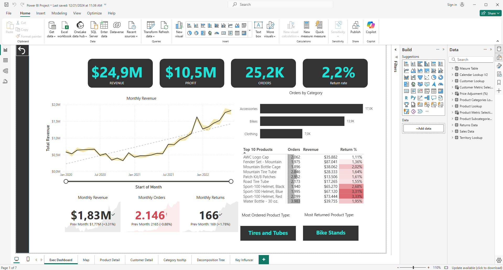
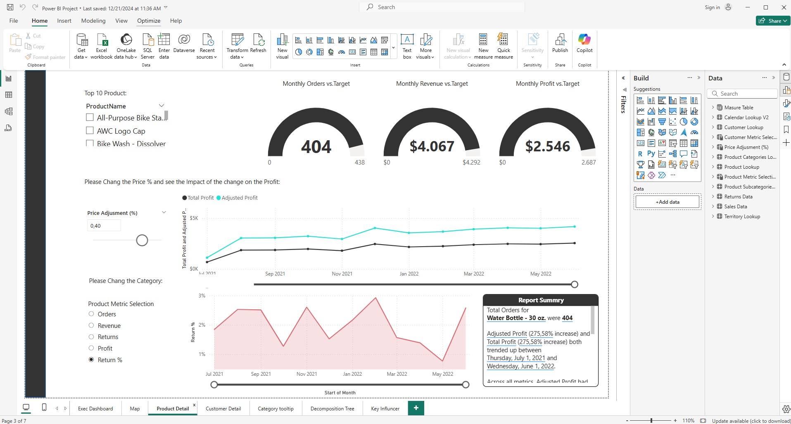
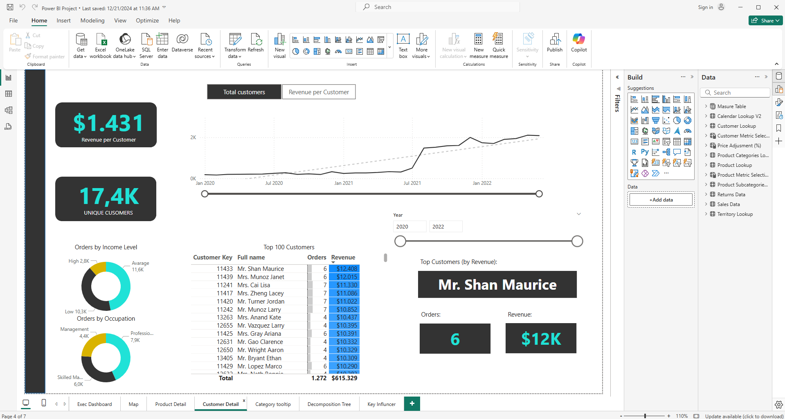
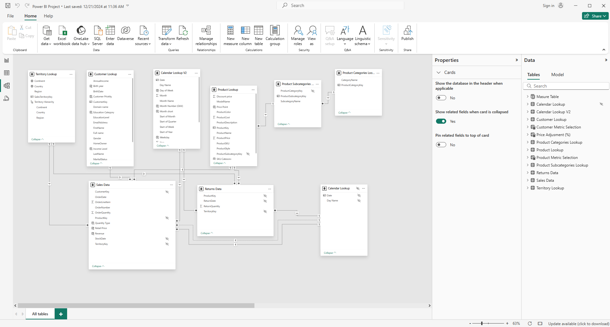

# Power-BI-Project

This project is an interactive business dashboard built with Power BI, designed to provide a clear and comprehensive overview of company performance. The dashboard visualizes key performance indicators (KPIs) and enables effective monitoring of sales, customer activity, and product trends.

# **Features:**

**.**  Revenue: Displays total revenue generated.

**.**  Profit: Shows overall profit earned.

**.**  Total Orders: Indicates the total number of completed orders.

**.**  Return Rate: Tracks the percentage of returned orders.

**.**  Revenue per Customer: Shows the average revenue generated per customer.

# Screenshots

